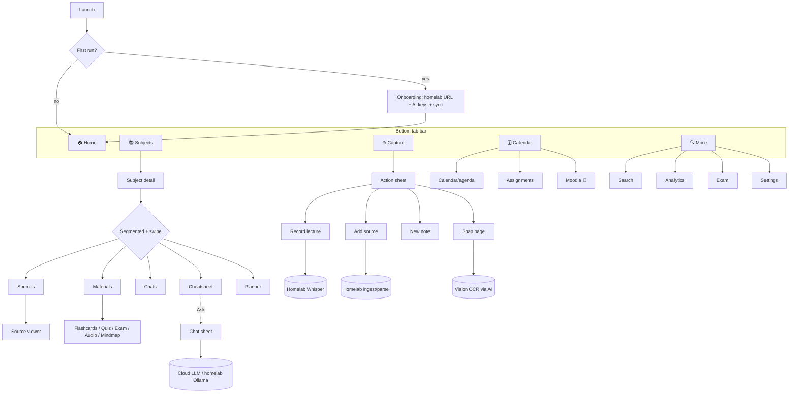

# Cortex Mobile — Port & Redesign Design

> Status: **Design / not yet built.** This document is the agreed plan for porting Cortex to phones.
> No application code has been changed by this document.
>
> Decisions (confirmed): **Tauri 2 mobile (one repo, Android + iOS)** · **iOS-first** · **music cut on
> mobile** · **identical theme + identical page headers (visual continuity — see §3.4)** · this session
> delivers the design only.

---

## 1. TL;DR

Cortex is already further along than a "port" usually implies. The Rust core is **Tauri 2 and
already mobile-entry-ready** (`src-tauri/src/lib.rs:38` → `#[cfg_attr(mobile, tauri::mobile_entry_point)]`),
and the three things a phone genuinely *can't* do locally — **lecture transcription, heavy document
parsing, and embeddings** — already have homelab offload paths in the codebase (transcription and
embeddings are wired; document parsing is the one gap). The whole-vault **sync engine already
exists** (`src-tauri/src/sync.rs`).

So the mobile port is **three jobs, not a rewrite**:

1. **A new touch shell** over the *same* Svelte views — replace the sidebar/keyboard/command-palette
   chrome with a **bottom-tab + bottom-sheet** navigation model and touch-sized controls.
2. **`cfg(desktop)`-gate the native-only Rust** (mpv, age/rclone, gtk, tray, sidecars) so the core
   compiles for `aarch64-apple-ios` / `aarch64-linux-android`.
3. **Make the already-built server-offload paths the *only* path on mobile** for recording-transcription,
   document parsing, and (optionally) embeddings — and add the **one missing homelab service**
   (document parsing) to `homelab/docker-compose.yml`.

Every desktop feature keeps a mobile home. The only feature **cut** on mobile is the built-in music
player (phones already have Spotify / YT Music / system audio, and it depends on the `mpv` + `yt-dlp`
sidecars that can't ship on a phone).

---

## 2. Why Tauri 2 mobile — and what already exists

A Tauri 2 mobile target keeps **one repository, one Svelte frontend, one Rust command surface**
(~150 commands in `src-tauri/src/lib.rs:215-361`). A Flutter/React-Native rewrite would throw away 18
views + 35 components **and** force re-implementing every Rust command as an HTTP API. A PWA would lose
on-device SQLite + `sqlite-vec`, reliable file/mic access, and offline study. Tauri 2 mobile reuses
everything and matches the locked project decision ("web + mobile at v0.3, same stack").

**What the request asks for that the repo already has:**

| Capability the request needs | Already in the code? | Where |
|---|---|---|
| Sync to homelab when present | ✅ Whole-vault WebDAV sync, row-level merge | `src-tauri/src/sync.rs` (DB + `sources/`+`recordings/`, union-by-id newest-wins, tombstones) |
| Lecture transcription on the server | ✅ Remote Whisper tried **first**, local fallback | `commands.rs:2877` `transcribe()` → `transcribe_remote()` (OpenAI-compatible `/v1/audio/transcriptions`) |
| One address for the homelab | ✅ Unified base URL → `/searxng /whisper /ollama /sync` | `homelab.rs` `resolved_setting()` + `homelab/docker-compose.yml` (Caddy proxy on `:8080`) |
| Reach homelab from anywhere | ✅ local → Tailscale → public auto-fallback | `homelab.rs` `resolve()`, `sync.rs` `read_cfg()` (`sync_mode: auto`) |
| Offload embeddings / LLM | ✅ Ollama offload + cloud BYOK chat | `embed::from_settings(provider, gemini_key, ollama_url)`, `homelab::resolved_setting("ollama_url")` |
| Credentials never leak across devices | ✅ sync allowlist + hard credential guard | `sync.rs:232` `is_syncable_setting()` |

**The one missing server piece:** document **parsing** (PDF/PPTX/DOCX → text) is local-only
(`ingest.rs` spawns `pdftotext`, `libreoffice`/`soffice`, `pdftoppm`). A phone can't run these, so the
design adds a small homelab **ingest/parse** service (§7.2).

---

## 3. Architecture — one repo, runtime platform branch

### 3.1 Frontend: detect platform, swap the shell, reuse the views

The 18 views render *content*; the desktop chrome (sidebar, command palette, keyboard engine, chat
dock, resize handles) lives almost entirely in `src/App.svelte`. The plan: **keep the views, fork the
shell.**

```
src/
  lib/platform.ts          # NEW: isMobile, isIOS, isAndroid, safeAreaInsets
  App.svelte               # branch: <MobileShell/> vs <DesktopShell/> (today's App body)
  shell/
    DesktopShell.svelte    # NEW: today's App.svelte chrome moved here, unchanged
    MobileShell.svelte     # NEW: bottom-tab bar + sheet host + header
    mobile/
      BottomTabBar.svelte  # NEW: Home · Subjects · Capture · Calendar · More
      CaptureSheet.svelte  # NEW: Record · Add source · New note · Snap (camera OCR)
      ChatSheet.svelte     # NEW: full-screen chat (wraps existing ChatPanel)
      SearchSheet.svelte   # NEW: wraps existing GlobalSearch
      SubjectTabs.svelte   # NEW: segmented control + horizontal swipe between subject tabs
  views/ ...               # UNCHANGED — every view reused as-is, restyled responsively
```

`platform.ts` detection (Tauri exposes the OS):

```ts
import { platform } from "@tauri-apps/plugin-os";
const os = platform();                       // 'ios' | 'android' | 'linux' | 'macos' | 'windows'
export const isMobile  = os === "ios" || os === "android";
export const isIOS     = os === "ios";
```

The existing **responsive scaffolding is the bridge, not the destination.** `App.svelte:116-118`
already computes `tight (<760)` / `drawer (<1080)`; the mobile shell formalises `tight` into a real
touch layout instead of a squeezed desktop one. Views already carry `@media` rules down to 600px
(`app.css:1087`, `ExamView`, `Citations`, `AnalyticsView`, `Calendar`, `InfographicView`,
`MindMapView`) — those are the starting point for each view's touch pass.

The store (`store.svelte.ts`) is **shared unchanged**: `app.view`, `app.subjectTab`, all CRUD/sync
actions work identically; the mobile shell just drives them from tabs/sheets instead of keys.

### 3.2 Backend: `cfg(desktop)`-gate the native-only Rust

Everything below must be compiled out (or stubbed) on mobile. None of it is core to studying.

| Module / call | Why it can't run on a phone | Mobile treatment |
|---|---|---|
| `mpv.rs` (mpv + `yt-dlp` sidecar) | external binaries; no sidecars on mobile | `#[cfg(desktop)]`; music feature hidden in UI |
| `backup.rs` (`age` + `rclone` sidecars) | external binaries | `#[cfg(desktop)]`; sync replaces multi-device need |
| `ingest.rs` doc parsing (`pdftotext`, `libreoffice`, `pdftoppm`) | external binaries | offload to homelab ingest service (§7.2) |
| local Whisper in `commands.rs:2900-3060` (`whisper`, `whisper-cli`, ffmpeg, python venv) | external binaries | force **remote-only** transcription on mobile |
| `lib.rs:151-192` WebKitGTK/gtk block | Linux-only already (`#[cfg(target_os="linux")]`) | unaffected |
| Plugins: `single-instance`, `updater`, `process`, `tray-icon` | desktop concepts | drop from the mobile plugin set in `lib.rs` builder |
| `externalBin` in `tauri.conf.json:37` | sidecars not bundled on mobile | move to `tauri.desktop.conf.json` (mobile config omits it) |
| close-to-tray (`lib.rs:196-214`) | no tray on mobile | `#[cfg(desktop)]` |

`Cargo.toml` already isolates the Linux GUI deps under `[target.'cfg(target_os = "linux")']`, so those
won't fight the mobile build. The mobile plugin set adds `tauri-plugin-os` (platform detect) and a
mic/recording plugin (§7.1).

### 3.3 Data layer on device

- **SQLite**: `rusqlite` with `bundled` feature (`Cargo.toml`) compiles its own SQLite for the target
  — works on iOS/Android. DB lives in the app data dir via `app.path().app_data_dir()`
  (`lib.rs:71-76`), which resolves to the app sandbox on mobile. No path code changes needed.
- **`sqlite-vec`**: statically registered via `sqlite3_auto_extension` — pure C, expected to
  cross-compile to arm64. **Verify on device early (R3).** Fallback: offload semantic search to the
  homelab (§7.3) and keep only text search on-device.
- **27 migrations** run unchanged; the schema is portable.

---

### 3.4 Visual continuity — same theme, same headers (non-negotiable)

Mobile must look like the **same app**, not a sibling. Two hard rules govern every mobile screen:

- **Same theme system, verbatim.** Theming is a single global mechanism: `applyTheme()` sets
  `data-theme` on `<html>` (`store.svelte.ts:1331`) and `cortex.css` defines all 10 palettes
  (`[data-theme="osaka-jade"]` … `kanagawa`, `cortex.css:21+`), plus `data-read` (reading font) and
  `data-density`. It's root-element only, so it works **identically** on mobile — same tokens
  (`--bg / --surface / --accent / --fg …`), same 10 palettes, same **Follow Omarchy** behaviour. The
  mobile port introduces **no new theme and no mobile-only colours** — every new piece of mobile chrome
  (bottom tab bar, sheets, segmented control) is styled **purely from the existing tokens**.
- **Same page headers, everywhere possible.** Desktop already unifies titles: the per-view title
  classes (`.cs-title`, `.addpage-title`, `.set-title`) all map onto the shared **`.page-title`** mono
  header (`app.css:136-138`). The mobile header bar uses that **same `.page-title` treatment** on every
  screen, so a heading on the phone reads exactly like its desktop counterpart. New mobile screens
  **reuse `.page-title`** — they never invent their own header style. Where a screen has no desktop
  twin, it adopts the nearest existing `.page-title` variant for continuity.

## 4. Navigation & flow redesign

### 4.1 The desktop model → touch model

Desktop Cortex is keyboard-first. The five desktop navigation mechanisms each get a touch equivalent:

| Desktop mechanism (`App.svelte`) | Touch replacement |
|---|---|
| Sidebar subject/topic tree (`Sidebar.svelte`) | **Subjects tab** → list → subject detail; topics are collapsible sections |
| Command palette `:` (`CommandPalette.svelte:243`) | **removed** — its actions live on the relevant screen's overflow (⋯) menu + the Capture sheet |
| Leader pane `space` (`LeaderPane.svelte`) | **removed** — replaced by bottom tabs + per-screen actions |
| Helix/vim keybinds, `Alt+1..9`, `g`-prefix | **removed** on mobile (no hardware keyboard assumed); keybind engine `#[cfg(desktop)]`-style gated in the mobile shell |
| `Ctrl+K` global search / `Ctrl+F` find | **More tab → Search** (and a search affordance in headers); find-in-page dropped on mobile |

Nothing the keybinds did is *lost* — each command they triggered is reachable by tab, header action,
or the Capture sheet. The keyboard was an accelerator, not the only path.

### 4.2 Bottom-tab information architecture

Five thumb-reachable destinations (center one elevated for the primary action):

```
┌──────────────────────────────────────────────┐
│  Organic Chemistry          🔔   ⚙︎/⋯          │  ← header: same .page-title mono treatment + notifications + overflow
│                                                │
│   [ Cheatsheet  Sources  Chats  Materials  Planner ]  ← segmented control (subject detail)
│   ─────────────                                 │     swipe left/right between tabs
│                                                │
│   ## Reaction mechanisms                        │
│   • SN1 vs SN2 …                                │  (existing Cheatsheet view, restyled for touch)
│   • …                                           │
│                                                │
│                          ╭─────╮  ← "Ask" pill (opens ChatSheet) when in a subject
│                          │ Ask │                │
│                          ╰─────╯                │
├──────────────────────────────────────────────┤
│   🏠        📚        ⊕        🗓        🔍      │  ← bottom tab bar (safe-area aware)
│  Home   Subjects   Capture  Calendar  More      │
└──────────────────────────────────────────────┘
```

- **🏠 Home** — Dashboard: subject cards, "due now" review count, today's agenda, focus-timer pill,
  streak. (existing `Dashboard.svelte`, reflowed to a single column.)
- **📚 Subjects** — list of subjects → **Subject detail** with the existing 5 inner tabs as a
  **segmented control** (`SubjectView.svelte:15-19`: Cheatsheet · Sources · Chats · Materials ·
  Planner), swipeable left/right.
- **⊕ Capture** — elevated center button → **action sheet**: *Record lecture · Add source · New note ·
  Snap a page (camera→OCR)*. This replaces the desktop's scattered "+" entry points and the
  command-palette "add" verbs.
- **🗓 Calendar** — month/agenda + assignments + deadlines (existing `CalendarView` + Planner data);
  the Moodle 🔔 notification bell lives in this tab's header.
- **🔍 More** — Global search, Study Analytics, Exam mode, Settings, Citations, Notes index — a simple
  scrollable menu (the "everything else" drawer).

### 4.3 Overlays → sheets, gestures, back-nav

- **Chat**: desktop dock/FAB (`App.svelte:360-384`) → **full-screen bottom sheet** (`ChatSheet`)
  wrapping the existing `ChatPanel`; scope switcher (Subject/Topic/Source) becomes a segmented control
  at the top of the sheet. Generation already survives the panel closing (store owns it,
  `store.svelte.ts:456-546`), so closing the sheet mid-answer is already safe.
- **Search / Notifications / Pomodoro / Music(desktop only) / Diff-review / EditModal** → bottom sheets.
- **Gestures**: horizontal **swipe** between subject segmented-tabs; **swipe-from-left-edge = back**
  (mirrors the existing Esc back-stack in `App.svelte:124-145`); **pull-to-refresh** on lists triggers
  `app.refresh()` + `app.syncNow()`. Long-press replaces right-click context menus
  (`ContextMenu.svelte`).
- **Drag-reorder** (subjects/topics/sources via `dnd.ts`): keep, but behind an explicit **"Reorder"
  affordance** (drag handles appear on long-press / an edit toggle) — free-form HTML5 DnD is hostile on
  touch.

### 4.4 Mobile flow map



---

## 5. Feature-treatment matrix

Legend: **Keep** = works on touch with restyle · **Responsive** = real layout rework · **Offload** =
runs on homelab · **Cut** = not on mobile.

| Feature / view | Desktop-only friction | Mobile treatment | Server reliance |
|---|---|---|---|
| Dashboard (`Dashboard.svelte`) | wide grid, keyboard focus ring | **Responsive** — single-column cards, due-now + agenda | none |
| Subject detail tabs (`SubjectView`) | top tab strip | **Responsive** — segmented control + swipe | none |
| Cheatsheet (`Cheatsheet.svelte`) | wide reading pane, print CSS, index rail | **Responsive** — single column, collapsible topic index, sticky section nav | gen = cloud/Ollama (already) |
| Diff review (`DiffModal`) | side-by-side diff | **Responsive** — stacked add/remove, swipe approve/reject | none |
| Sources list + viewer (`SourceViewer`) | wide preview, PDF.js | **Responsive** — list + full-screen viewer; PDF via on-device viewer | originals lazy-fetched from sync |
| Add source (`AddSource`) | file picker, side-by-side, key hints | **Responsive** — full-screen stepper; file/photo/share-sheet import | **Offload** parse (§7.2) |
| Lecture recorder (`Recorder.svelte`) | `getUserMedia`+`MediaRecorder` capture, live transcribe | **Responsive + Offload** — native mic plugin (R1), **remote-only** transcription | **Offload** Whisper (exists) |
| Flashcards (`Flashcards.svelte`) | keyboard grade keys | **Keep** — tap/swipe to flip + grade (Again/Hard/Good/Easy) | none (SRS local) |
| Quiz (`Quiz.svelte`) | keyboard nav | **Keep** — tap options, big targets | gen = cloud |
| Exam mode (`ExamView`) | timed, wide | **Responsive** — full-screen timed runner, single-column | gen/grade = cloud |
| Generate material (`GenerateMaterial`) | side-by-side, steppers | **Responsive** — full-screen stepper | gen = cloud |
| Materials — audio overview | TTS file + `<audio>` | **Keep** — native `<audio>`; cloud TTS or homelab | TTS cloud/homelab |
| Materials — infographic (SVG) | large canvas | **Keep** — pinch-zoom SVG | gen = cloud |
| Materials — slideshow video | FFmpeg stitch (desktop) | **Offload/Defer** — render on homelab or desktop; mobile views result | **Offload** render |
| Materials — mindmap (`MindMapView`) | large graph, hover | **Responsive** — pan/pinch canvas, tap nodes | gen = cloud |
| Notes (`NotesView`, `MarkdownEditor`) | print CSS, wide editor | **Responsive** — full-screen editor, formatting toolbar | none |
| Chat (`ChatPanel`) | resizable dock | **Responsive** — full-screen `ChatSheet` | cloud LLM / homelab Ollama |
| Calendar (`CalendarView`) | month grid, DnD | **Responsive** — agenda-first + compact month; tap to add | optional Google sync |
| Planner / Assignments (`Citations.svelte` tab) | wide, rings | **Responsive** — list + progress rings, swipe done | none |
| Citations / references | table | **Responsive** — card list + add form | none |
| Analytics (`AnalyticsView`) | wide charts, heatmap | **Responsive** — stacked cards, scrollable heatmap | none |
| Global search (`GlobalSearch`) | `Ctrl+K` | **Responsive** — Search in More tab + header | semantic = local or offload |
| Notifications / Moodle | notification center panel | **Keep** — sheet from 🔔; OS push later | Moodle fetch |
| Settings (`Settings.svelte`, 70 KB) | dense tabs | **Responsive** — grouped list → sub-screens; **Homelab section promoted** | — |
| Onboarding (`Onboarding`) | desktop flow | **Responsive** — first-run: homelab URL + AI keys + sync opt-in | — |
| Music (`MusicPanel`, `mpv.rs`) | mpv + yt-dlp sidecars | **CUT on mobile** — feature hidden | — |
| Command palette / leader / vim keys | keyboard | **Removed** — actions redistributed to tabs/sheets/overflow | — |
| Backups (`backup.rs`, age/rclone) | sidecars | **Hidden** — sync covers multi-device durability | sync |

**No feature is silently dropped.** Music is the only intentional cut, and it's replaced by the
phone's own audio apps. Everything else is reachable.

---

## 6. Per-feature deep dives (the non-trivial ones)

### 6.1 Lecture recorder (the request's headline example)
- **Capture**: the current web `MediaRecorder`/`getUserMedia` path (`Recorder.svelte:436,456`) is
  **unreliable in iOS WKWebView**. Add a small Tauri mobile **audio plugin** (Rust ↔ AVAudioRecorder /
  Android MediaRecorder) that writes an `m4a/opus` file and returns its path. Add
  `NSMicrophoneUsageDescription` (iOS) + `RECORD_AUDIO` (Android).
- **Transcription**: **remote-only on mobile.** `save_recording` already calls `transcribe()`, which
  already prefers the homelab Whisper (`commands.rs:2877`). On mobile we **skip the local fallback
  entirely** (gate out the `whisper`/python branch) and require a configured `whisper_url`. If no
  homelab is connected, the UI says so up-front and offers "save audio now, transcribe when connected"
  (the audio file syncs; transcription runs on next connect via the existing failed-source retry,
  `store.svelte.ts:784`).
- **Live transcription** (`transcribePartial`) stays, pointed at the homelab; or is disabled when
  offline.

### 6.2 Add source / ingestion
- **Import surfaces**: iOS/Android **share sheet** ("Open in Cortex"), Files/Photos picker, paste URL,
  camera capture. Each produces a file or URL → existing `add_source` command.
- **Parsing**: text/markdown/URL parse locally (cheap). **PDF/PPTX/DOCX must offload** (§7.2) because
  `pdftotext`/`libreoffice`/`pdftoppm` can't run on a phone. The `add_source`/ingest pipeline gains a
  branch: on mobile (or when local binaries absent), POST the file to the homelab ingest service and
  receive extracted text back, then chunk/embed as today.
- **Image/handwriting OCR**: already done via a vision model in the cloud (`commands.rs` OCR prompt) —
  works on mobile unchanged; the **Snap** capture feeds straight into it.

### 6.3 Cheatsheet
The marquee reading surface. Single-column; the topic **index becomes a collapsible drawer / sticky
chips**; section state (draft/approved) shown inline; **swipe a draft section to approve** (replaces the
desktop diff click). Generation is unchanged (cloud/Ollama). Print CSS (`Cheatsheet.svelte:1007`)
becomes "Export PDF" → rendered server-side or via share sheet (no headless Chromium on device).

### 6.4 Settings
Reorganise the dense desktop tabs into a **grouped list → sub-screens** (iOS Settings style). The
**Homelab** section is promoted to the top on mobile and made central: one base URL, optional Tailscale
+ public bases, "Test connection", and clear per-capability status (Whisper ✓ / Search ✓ / Ingest ✓ /
Sync ✓). Keybinds/vim/tray/window settings are hidden on mobile.

### 6.5 Calendar & Planner
Default to an **agenda list** (today forward) with a compact month toggle — month grids are unusable at
390px. Add events with a full-screen form; long-press a day to add. Assignments (the `Citations` tab,
which overloads `CalEvent`) render as cards with progress rings + swipe-to-done.

---

## 7. Server-offload architecture

### 7.1 Recording → transcription (exists; force remote on mobile)
Already implemented end-to-end. Mobile change = **remove the local fallback** and require
`whisper_url`/`homelab_base`. The `speaches` container (`docker-compose.yml:52`, OpenAI-compatible ASR)
is the server. No new infra.

### 7.2 Document parsing — **NEW homelab service** (the one gap)
Add a tiny parse service behind the Caddy proxy at `/ingest`:

```yaml
  ingest:
    image: cortex/ingest:latest          # small FastAPI/Tika or unstructured-io worker
    container_name: cortex-ingest
    restart: unless-stopped
    expose: ["8083"]
    # POST /v1/extract  (multipart file)  -> { text, pages, warnings }
    # handles pdf (pdftotext/poppler), docx/pptx (libreoffice headless), ocr (tesseract/pdftoppm)
```

- Caddyfile: route `/ingest/*` → `ingest:8083`.
- `homelab.rs`: add `"ingest_url" => Some("/ingest")` to `service_path()` so it follows the unified base
  URL + Tailscale/public fallback like the others.
- `ingest.rs`: when on mobile **or** when a local binary is missing, call the remote extractor instead
  of `Command::new`. Same downstream chunk/embed.

This also **improves the desktop** (users without LibreOffice installed get parsing for free when a
homelab is connected).

### 7.3 Embeddings & search
- **Embeddings**: already offloadable to homelab Ollama (`nomic-embed-text`) via `ollama_url`. On
  mobile, default embedding to the homelab when connected; cloud Gemini embeddings as BYOK fallback.
- **Vector search**: try on-device `sqlite-vec` first (R3). If it won't build for arm, offload search
  to the homelab (the homelab already holds the full synced DB and Ollama). Text search stays local.

### 7.4 What stays cloud (already mobile-friendly)
Chat/cheatsheet/material/exam generation use the cloud BYOK router (Gemini/OpenRouter/Claude) over
HTTPS — **works on mobile with zero changes**. TTS for audio overviews is cloud/homelab already.

---

## 8. Sync on mobile (reuse what exists)

`sync.rs` already does exactly what multi-device needs: push the whole DB + binary vault to WebDAV,
pull + **row-merge** (union by id, newest-wins, tombstones). It's transport-agnostic and already
addressed via the unified homelab base (`/sync`). Mobile reuses it verbatim, with three mobile-specific
policies:

1. **Wi-Fi-only by default** (R5) — a new `sync_wifi_only` setting; cellular sync is opt-in. Avoids
   pushing the whole DB + originals over a metered connection.
2. **Lazy-fetch originals** (R5) — the binary file sync (`sync_files`, `sync.rs:580`) currently pulls
   *every* `sources/`+`recordings/` file. On mobile, **don't pre-pull**; fetch an original on demand
   when the user opens it, and cache with a size cap. DB rows (which carry extracted `content`) sync
   fully, so cheatsheets/chat/search work without the binaries.
3. **Foreground + resumable** (R6) — run push/pull while the app is foregrounded; the existing
   debounced `scheduleSync()` (`store.svelte.ts:1007`) + launch pull already fit this; add an explicit
   "Sync now" + last-synced indicator in the mobile header.

The credential guard (`is_syncable_setting`, `sync.rs:232`) already keeps API keys/tokens/URLs from
syncing — so a phone and laptop share study data but each keeps its own secrets. No change needed.

---

## 9. No-homelab degradation matrix

Core single-device studying must never require a homelab (ISC-A2). With **no homelab connected**, on a
phone:

| Works fully offline / cloud-only | Needs homelab (degraded/disabled without it) |
|---|---|
| Read/edit subjects, topics, sources, notes | Lecture **transcription** (audio still records + saves; transcribes on next connect) |
| Cheatsheets, chat, materials, quizzes, exams (cloud BYOK keys) | **PDF/PPTX/DOCX** import (text/URL/photo-OCR still work cloud-side) |
| Flashcards + SRS, analytics, calendar, planner | Multi-device **sync** |
| Text search; semantic search if `sqlite-vec` builds | Self-hosted **web search / diagram images** (SearXNG) |
| Google Calendar / Moodle (their own cloud) | Homelab **Ollama** embeddings (cloud Gemini embeddings as fallback) |

So a student with just AI keys and no homelab still has a fully usable study app; the homelab unlocks
transcription, heavy-doc import, and sync.

---

## 10. Build-config changes (reference checklist — for the build phase, not now)

- `src-tauri/`: `tauri android init` / `tauri ios init` (generates `gen/android`, `gen/apple`).
- Split config: `tauri.conf.json` (shared) + `tauri.desktop.conf.json` (sidecars/tray/updater) +
  `tauri.mobile.conf.json` (no `externalBin`, mobile bundle ids, orientation, permissions).
- `Cargo.toml`: gate desktop-only deps/modules with `#[cfg(desktop)]`; add `tauri-plugin-os` and an
  audio/mic plugin for mobile; keep the Linux GUI deps under their existing `cfg(target_os="linux")`.
- `lib.rs` builder: conditionally register the desktop-only plugins (`single-instance`, `updater`,
  `process`, tray, close-to-tray) under `#[cfg(desktop)]`; register mobile plugins under `#[cfg(mobile)]`.
- iOS `Info.plist`: `NSMicrophoneUsageDescription`, `NSPhotoLibraryUsageDescription`, App Transport
  Security exception for plain-HTTP LAN homelab (or require HTTPS/Tailscale).
- Android `AndroidManifest.xml`: `RECORD_AUDIO`, `INTERNET`, optional `usesCleartextTraffic` for LAN.
- `homelab/`: add the `ingest` service + Caddy route; bump README.

---

## 11. Phased roadmap (iOS-first)

> iOS builds require macOS + Xcode + an Apple Developer account (not buildable from the current Arch
> Linux box). **Android is buildable locally now** and is recommended as the smoke-test target while
> iOS tooling is arranged — the code is identical.

- **Phase 0 — Foundation (no UX yet).** `tauri ios/android init`; `cfg(desktop)`-gate native-only Rust;
  prove the app boots on a simulator/emulator with on-device SQLite + `sqlite-vec` (R3 gate). *Exit:
  blank-but-running app reads/writes the DB.*
- **Phase 1 — Touch shell.** `platform.ts`, `MobileShell`, bottom tabs, Capture sheet, ChatSheet,
  segmented subject tabs, gestures. Reuse all views with first-pass responsive CSS. *Exit: navigate the
  whole app by touch.*
- **Phase 2 — Server-offload correctness.** Force remote transcription; add homelab `/ingest` service +
  client branch; embeddings/search offload; remote-only guards + clear "needs homelab" messaging. *Exit:
  record a lecture → transcript via homelab; import a PDF via homelab.*
- **Phase 3 — Sync polish.** Wi-Fi-only, lazy-fetch originals, sync indicator, conflict UX. *Exit: edit
  on laptop, see it on phone, and back.*
- **Phase 4 — Per-view touch polish.** Cheatsheet reading, Calendar agenda, Materials viewers,
  Settings restructure, Recorder native plugin (R1), onboarding. *Exit: each screen feels native.*
- **Phase 5 — Native capture + store prep.** Native mic plugin, share-sheet import, camera OCR, OS push
  notifications, icons/splash, TestFlight / Play internal track.

---

## 12. Risks & prerequisites

| # | Risk | Mitigation |
|---|---|---|
| R1 | iOS WKWebView mic capture (`getUserMedia`) unreliable | Native audio plugin + Info.plist; don't rely on web `MediaRecorder` |
| R2 | No remote document-parse endpoint exists | Add `/ingest` homelab service (§7.2) — the one net-new piece |
| R3 | `sqlite-vec` may not build for arm64 | Verify in Phase 0; fall back to homelab-offloaded search |
| R4 | iOS-first but no Mac on the dev box | Design is build-ready; arrange macOS/Xcode; smoke-test on Android meanwhile |
| R5 | Whole-DB + originals sync over cellular is heavy | Wi-Fi-only default + lazy-fetch originals |
| R6 | Mobile OS suspends background work | Foreground execution + resumable offload (reuse failed-source retry) |

**Prerequisites to start building:** macOS + Xcode + Apple Developer account (iOS); Android SDK/NDK
(Android, works on Linux); a homelab running the updated `docker-compose.yml` (adds `/ingest`).

---

*Next step when you're ready to build: start with **Phase 0** (foundation + `cfg(desktop)` gating),
which is reversible and leaves the desktop app untouched. Say the word and I'll scaffold it.*
